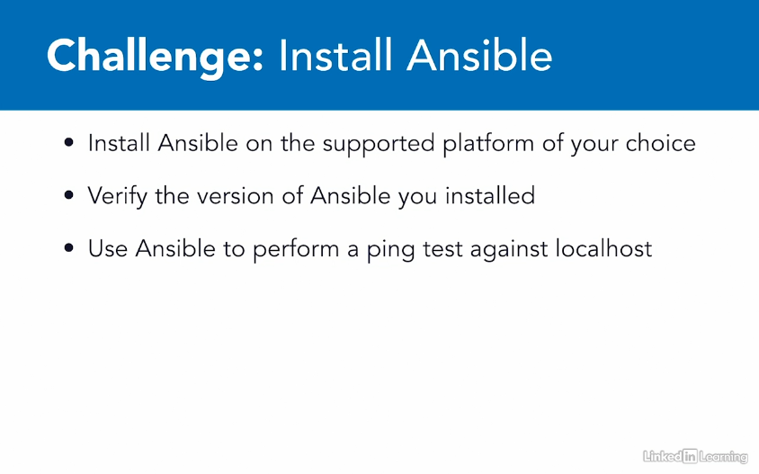

# Learning Ansible - Linkedin Learning

## Challenge 1
### Install Ansible


## Requirements
- CentOS 7 (minimal installation)

## Ansible Installation

### Install python 3
```shell
yum update
yum install -y python3
python3 --version
```
### Install ansible with pip
```shell
pip3 install ansible
```
### Test Ansible installation
```shell
ansible --version
ansible localhost -m ping
```


## References
- [Install CentOS 7 minimal installation](https://phoenixnap.com/kb/how-to-install-centos-7)
- [Setup network after CentOS 7 minimal installation](https://lintut.com/how-to-setup-network-after-rhelcentos-7-minimal-installation/)
- [Install python3 on CentOS 7](https://www.liquidweb.com/kb/how-to-install-python-3-on-centos-7/)
- [Installing Ansible](https://docs.ansible.com/ansible/latest/installation_guide/intro_installation.html#installing-ansible-on-rhel-centos-or-fedora)
- [Installing Ansible with pip](https://docs.ansible.com/ansible/latest/installation_guide/intro_installation.html#installing-ansible-with-pip)
