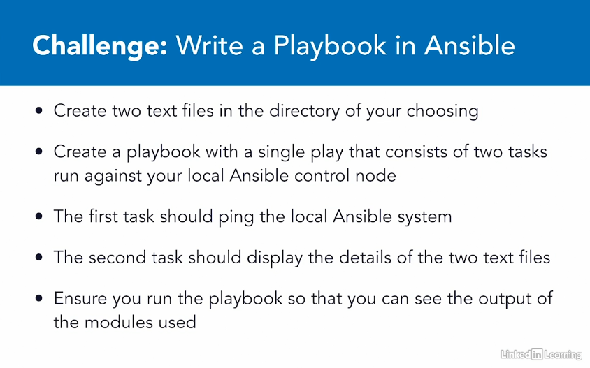

# Learning Ansible - Linkedin Learning

## Challenge 2
### Write a Playbook in Ansible


### Requirements
- CentOS 7 with Ansible installed

#### Create two text files in the directory of your choose
```shell
cd ~
touch file01.txt
touch file02.log
```

#### Create a Playbook with a single play that consists of two tasks run against your local Ansible control node
- The first task should ping the local Ansible system
- The second task should display the details of the two text files
```shell
touch my-first-playbook.yml
```
```yaml
---
  - name: "My first Playbook with Ansible"
    hosts: localhost

    - tasks:

      - name: "Ping the localhost"
        ping:

      - name: "Display the details of created files"
        find:
          path: ~/
          file_type: file
          patterns: '*.txt,*.log'
```

#### Ensure you run the playbook so that you can see the output of the module used
```shell
ansible-playbook my-first-playbook.yml -v
```

## References
- [Ansible - find module](https://docs.ansible.com/ansible/latest/collections/ansible/builtin/find_module.html)
- [Run Your First Command and Playbook](https://docs.ansible.com/ansible/latest/network/getting_started/first_playbook.html)
- [Getting Started: Writing Your First Playbook](https://www.ansible.com/blog/getting-started-writing-your-first-playbook)
- [How to Create an Ansible Playbook](https://www.inmotionhosting.com/support/edu/ansible/create-an-ansible-playbook/)
- [Ansible Playbook: How to Create and Configure Playbooks](https://phoenixnap.com/kb/ansible-playbook)
